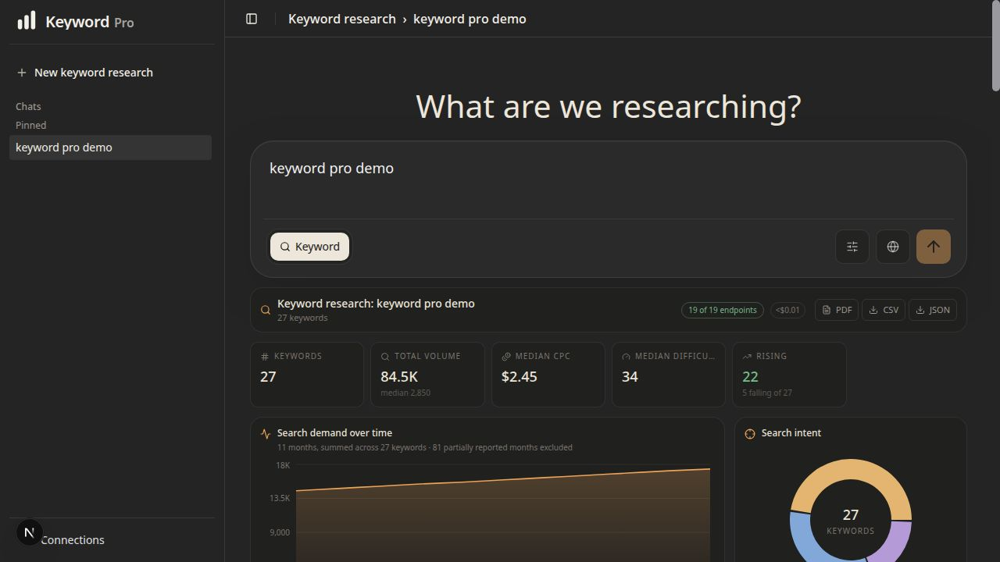
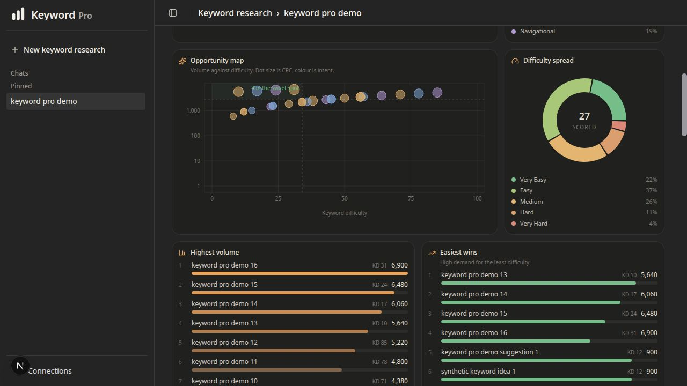
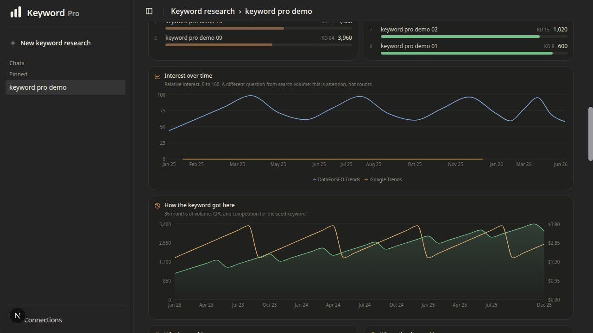
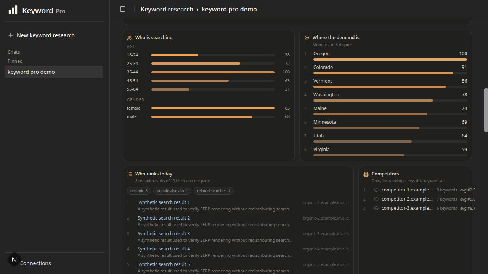
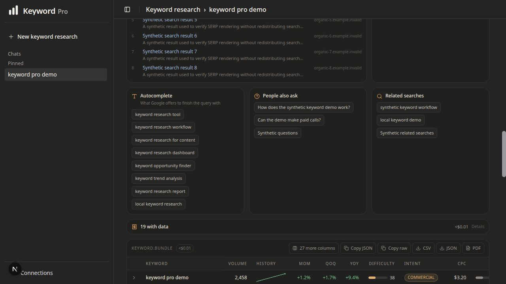
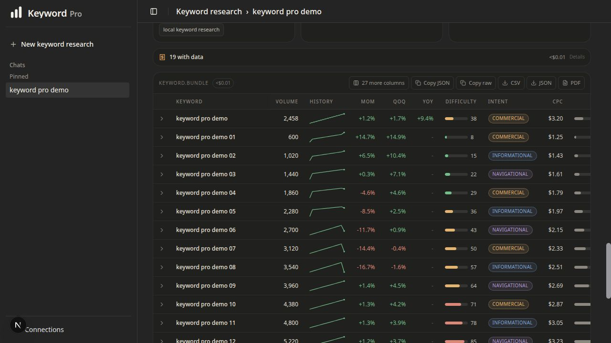
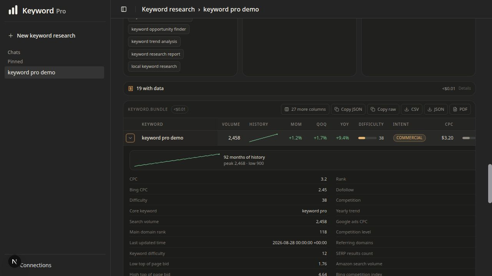
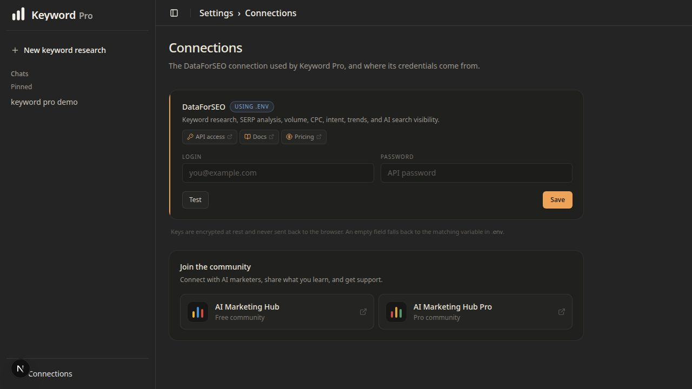

# Keyword Pro

<p align="center">
  
</p>

Keyword Pro is a standalone, local keyword research console. It combines a
guided keyword report with an advanced endpoint explorer, saved research
sessions, charts, and exports.

There is no signup, billing layer, or hosted account system. One local user owns
the database and supplies their own DataForSEO credentials.

## Application

The screenshots below were captured from the actual local application using a
deterministic synthetic report. They contain no account data, credentials, or
captured provider results. Live results vary by query, market, language, and
available provider data.

### Research workspace



### Opportunity and difficulty



### Trends and history



### Audience and regional demand



### Search discovery



### Keyword table



### Keyword details



### Connections



## What it does

- Runs a guided, market-aware report with up to 19 calls covering volume, CPC,
  difficulty, intent, trends, SERP competitors, and related terms.
- Offers 94 markets and all 46 languages supported by the guided keyword
  report. The picker shows the complete report catalog, prevents invalid
  country-language pairs, and skips unsupported Bing or Amazon calls before
  they can spend money.
- Exposes 332 keyword-oriented DataForSEO endpoint definitions in
  Advanced mode.
- Saves completed reports locally so reopening a report makes no paid API call.
- Exports keyword results as PDF, CSV, and JSON.
- Displays the estimated cost before a paid run begins.

Keyword Pro admits keyword endpoints only. Website, Social, and Commerce modes
are not available in the interface or through the run APIs.

## Run locally

Requirements: Node.js 24, pnpm 9, OpenSSL, and Podman or Docker.

```bash
cp .env.example .env
openssl rand -base64 32
pnpm install --frozen-lockfile --ignore-workspace
```

Paste the OpenSSL output into `KEYWORD_PRO_ENCRYPTION_KEY` in `.env` before
starting the app. To keep the key outside `.env`, leave that value empty and set
`KEYWORD_PRO_ENCRYPTION_KEY_FILE` to a private file containing the generated
key. For rotation, configure `KEYWORD_PRO_ENCRYPTION_KEYS` with named keys and
select the write key with `KEYWORD_PRO_ENCRYPTION_KEY_ACTIVE`. Then run:

```bash
./dev-up.sh
```

The startup script validates the required settings before starting local
services.

In another terminal, initialize the local database on the first run:

```bash
pnpm --ignore-workspace db:migrate
pnpm --ignore-workspace seed
```

`db:migrate` creates a fresh canonical schema or transactionally upgrades the
legacy private-preview table names without rewriting saved reports or encrypted
credential values. It stops on a mixed or ambiguous schema instead of guessing.

After upgrading a private-preview database, inspect retained compatibility data
without printing record identifiers, cached payloads, or encrypted values:

```bash
pnpm --ignore-workspace legacy:inventory
```

If you choose to preserve that data outside PostgreSQL, create a private
directory outside the repository and provide an explicit new filename:

```bash
mkdir -m 700 ../keyword-pro-private
pnpm --ignore-workspace legacy:export -- \
  --output ../keyword-pro-private/legacy-compatibility.json
```

The export includes all saved sessions and opportunities plus retained legacy
credential ciphertext. It excludes current DataForSEO credentials, never
decrypts values, writes mode `0600`, refuses overwrites, and refuses paths
inside the repository. Treat the resulting file as private. No export or
deletion happens automatically.

Open `http://localhost:3002/keyword-pro`.

Keyword Pro binds to `127.0.0.1` by default. It is a local, single-user tool,
not a hardened hosted or multi-user service. Do not expose it directly to a LAN
or the internet without adding authentication and a deployment-specific
security review.

## Routes

```text
/keyword-pro                        keyword console
/keyword-pro/research/[sessionId]   saved keyword report
/settings/connections               DataForSEO credentials
/settings/profile                   local profile
/api/v1/research/run                one keyword endpoint
/api/v1/research/module/run         curated keyword module
/api/health                         database check
```

## Credentials and cost

DataForSEO credentials can be entered under Settings, Connections or supplied
through `.env`. Saved values are encrypted with AES-256-GCM and are never sent
back to the browser in plaintext.

Live research calls spend money from the connected DataForSEO account. The
available report sources and estimate vary by country and language. The offline
verification commands do not call a provider and do not spend money.

Keyword Pro is an independent project and is not affiliated with or endorsed
by DataForSEO.

## Community

- [AI Marketing Hub, free community](https://www.skool.com/ai-marketing-hub)
- [AI Marketing Hub Pro](https://www.skool.com/ai-marketing-hub-pro)

## Verify

```bash
pnpm --ignore-workspace run ci
```

The CI suite performs linting, type checking, offline behavioral verification,
and a production build. These checks do not make paid provider calls.

To run the built application locally, use the validated package command:

```bash
pnpm --ignore-workspace start
```

It checks the database TLS decision and encryption-key material before opening
the loopback application port.

## Project documentation

- [Architecture and trust boundaries](docs/ARCHITECTURE.md)
- [Distribution provenance](docs/DISTRIBUTION-PROVENANCE.md)
- [Contributing](CONTRIBUTING.md)
- [Code of conduct](CODE_OF_CONDUCT.md)
- [Support](SUPPORT.md)
- [Governance](GOVERNANCE.md)
- [Security policy](SECURITY.md)
- [Public readiness report](docs/PUBLIC-READINESS-REPORT-2026-08-28.md)
- [Release checklist](docs/RELEASING.md)
- [v1.0.0-rc.1 release notes](docs/releases/v1.0.0-rc.1.md)
- [Future v1.0.0 release draft](docs/releases/v1.0.0.md)
- [Third-party notices](THIRD_PARTY_NOTICES.md)

## License

Keyword Pro is open source under the [Apache License 2.0](LICENSE).

## Release status

The package version is `v1.0.0-rc.1`, the first public release candidate.
Published releases come from immutable annotated tags after the tagged commit
passes GitHub Actions. See the
[GitHub Releases page](https://github.com/AgriciDaniel/keywordpro/releases) for
the latest published build.
