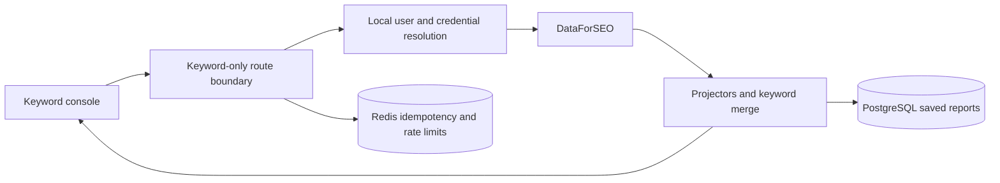

# Keyword Pro architecture

Keyword Pro is a single-user Next.js application for local keyword research.
The browser never receives stored provider credentials.

## Trust boundaries

1. The API rejects non-keyword endpoint and module identifiers before provider
   credentials are resolved or a paid call can begin. Targeted calls also
   validate the country-language pair and known search-engine availability at
   the shared dispatcher boundary.
2. DataForSEO credentials come from server environment variables or encrypted
   database fields. Saved credentials are write-only from the browser's point
   of view.
3. The encryption key remains in the server environment and is never stored in
   PostgreSQL.
4. Redis supports idempotency and rate limiting. The application has bounded
   in-process fallbacks for local development.
5. Saved keyword reports may contain business-sensitive research. Backups and
   exports should be handled as private data.
6. The development and production server commands bind to loopback. Database
   TLS is an explicit deployment setting because the bundled local database is
   plaintext on loopback while hosted databases should require TLS.

## Main application surfaces

- `src/app/[locale]/(protected)/keyword-pro`: console and saved report routes
- `src/app/api/v1/research`: keyword endpoint and curated module APIs
- `src/lib/research/keyword-pro-boundary.ts`: hard product boundary
- `src/lib/research/keyword-bundle-runner.ts`: guided bundle orchestration
- `src/lib/research/locations-languages.generated.ts`: provider-derived market,
  language, and family-specific Bing compatibility catalogs
- `src/lib/research/endpoint-targeting.generated.ts`: locale fields read by
  each executable provider request
- `src/components/research-console/results`: tables, charts, and exports
- `src/keyword-pro`: encrypted credential storage
- `src/db/migrations`: versioned, transactional database compatibility bridge
- `src/db/legacy-data.ts`: count-only inventory and explicit private export

## Distribution and compatibility boundary

The distributed endpoint allowlist, executable catalog, metadata, targeting,
browser modes, API routes, and provider dispatcher are Keyword Pro only. The
verification suite checks exact equality between the 332 allowlisted endpoint
identifiers and every executable or visible endpoint artifact.

The first database migration renames private-preview tables, constraints, and
indexes in place. It preserves table object identifiers, rows, JSON payloads,
foreign-key cascades, and encrypted bytes. Fresh installations receive only
canonical Keyword Pro objects. Upgraded databases may retain dormant legacy
credential columns until the owner explicitly exports or deletes them, but the
application schema never reads or rewrites those fields. The compatibility
inventory reports counts only. Its opt-in export copies raw ciphertext and
cached records to a new mode `0600` file outside the repository without
decrypting any value. Export and deletion remain separate owner decisions.
